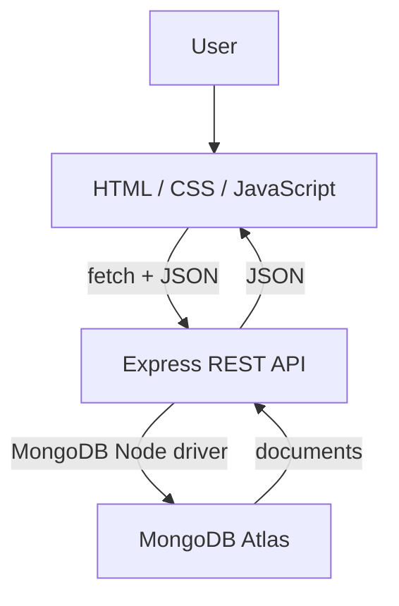

# Fullstack Brain Bucket
> A student directory that saves your records, majors, and notes in MongoDB.

`@ltortorigi` | `2026-10-01` | `HOTEL`

## Deployments + codebase

| Resource | Direct link |
| --- | --- |
| PROD code | [main](https://github.com/ltortorigi/fullstack-brain-bucket/tree/main) |
| PROD application | [GCP application](https://logan.barrycumbie.com/) |
| DEV code | [dev](https://github.com/ltortorigi/fullstack-brain-bucket/tree/dev) |
| DEV application | [Render application](https://fullstack-brain-bucket-dj2n.onrender.com/) |
| Documentation | [Published docs](https://ltortorigi.github.io/fullstack-brain-bucket/) · [source](https://github.com/ltortorigi/fullstack-brain-bucket/blob/hotel/student-crud/docs/README.md) |
| CI/CD | [Tests](https://github.com/ltortorigi/fullstack-brain-bucket/blob/hotel/student-crud/.github/workflows/test.yml) · [GCP deployment](https://github.com/ltortorigi/fullstack-brain-bucket/blob/hotel/student-crud/.github/workflows/deploy-main-to-gcp.yml) |

## HOTEL grading dashboard

| Requirement | Evidence |
| --- | --- |
| MongoDB Atlas connection | [MongoDB driver, environment config, connection + ping](https://github.com/ltortorigi/fullstack-brain-bucket/blob/hotel/student-crud/server/mongo.js) |
| GET all | [GET /api/students](https://github.com/ltortorigi/fullstack-brain-bucket/blob/hotel/student-crud/server/routes.js#L55) |
| GET one by identifier | [GET /api/students/:id and ObjectId validation](https://github.com/ltortorigi/fullstack-brain-bucket/blob/hotel/student-crud/server/routes.js#L73) |
| Filtered GET | [GET /api/students?major=CIS](https://github.com/ltortorigi/fullstack-brain-bucket/blob/hotel/student-crud/server/routes.js#L55) |
| POST / create | [POST /api/students](https://github.com/ltortorigi/fullstack-brain-bucket/blob/hotel/student-crud/server/routes.js#L80) |
| PATCH / update | [PATCH /api/students/:id](https://github.com/ltortorigi/fullstack-brain-bucket/blob/hotel/student-crud/server/routes.js#L88) |
| DELETE | [DELETE /api/students/:id](https://github.com/ltortorigi/fullstack-brain-bucket/blob/hotel/student-crud/server/routes.js#L94) |
| Frontend fetch + DOM updates | [Client JavaScript](https://github.com/ltortorigi/fullstack-brain-bucket/blob/hotel/student-crud/public/assets/js/hotel.js) · [HTML](https://github.com/ltortorigi/fullstack-brain-bucket/blob/hotel/student-crud/public/hotel.html) |
| Persistent CRUD | [Real MongoDB integration tests](https://github.com/ltortorigi/fullstack-brain-bucket/blob/hotel/student-crud/server/test/api.test.js); [GitHub Actions: 10 database/API tests passed](https://github.com/ltortorigi/fullstack-brain-bucket/actions/runs/36935645474); live Atlas verification pending |
| Secrets excluded from Git | [.gitignore](https://github.com/ltortorigi/fullstack-brain-bucket/blob/hotel/student-crud/.gitignore) · [blank environment template](https://github.com/ltortorigi/fullstack-brain-bucket/blob/hotel/student-crud/server/.env.example) |
| HOTEL milestone | Pending creation and assignment to issue #2 |
| Feature issue | [Issue #2](https://github.com/ltortorigi/fullstack-brain-bucket/issues/2) |
| Development branch | [hotel/student-crud](https://github.com/ltortorigi/fullstack-brain-bucket/tree/hotel/student-crud) |
| Feature → dev | [PR #3](https://github.com/ltortorigi/fullstack-brain-bucket/pull/3) |
| dev → main | PR pending DEV verification |
| Successful HOTEL PROD deployment | Pending; do not use the older GOLF run as HOTEL evidence |

## Use the app

1. Enter a name and major, then choose **Add student**.
2. Use **Filter** for an exact major (case-sensitive), or **Show all**.
3. Choose **View** to fetch one record by its ID, **Edit** to update it, or **Delete** to remove it.
4. Refresh the page to confirm records persist. **Find a student by ID** also supports a pasted MongoDB identifier.
5. Expand **API activity** to inspect the latest JSON response.

The directory is a classroom CRUD demo without authentication. Use fictional sample records.

## Architecture

Development flow: issue → feature branch → PR → dev → DEV test → PR → main → GitHub Actions → GCP / PM2 / Nginx.

Stack: HTML/CSS/JavaScript, Bootstrap 5, Bootstrap Icons, Node.js, Express 5, MongoDB Node.js Driver, Atlas, Git/GitHub, Render, GCP, PM2, Nginx, GitHub Actions.

## Setup + verification

See [SETUP.md](https://github.com/ltortorigi/fullstack-brain-bucket/blob/hotel/student-crud/docs/SETUP.md) for local, Render, and GCP setup, API examples, and the final deployment checklist.

The previous Brain Bucket idea-board files remain in `public/asdindex.html`, `public/pages/`, and `public/assets/`. The HOTEL directory is served at `/`, `/index.html`, and `/hotel.html`.
